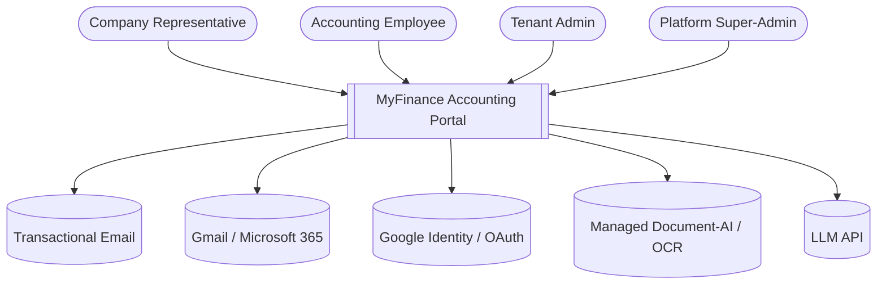
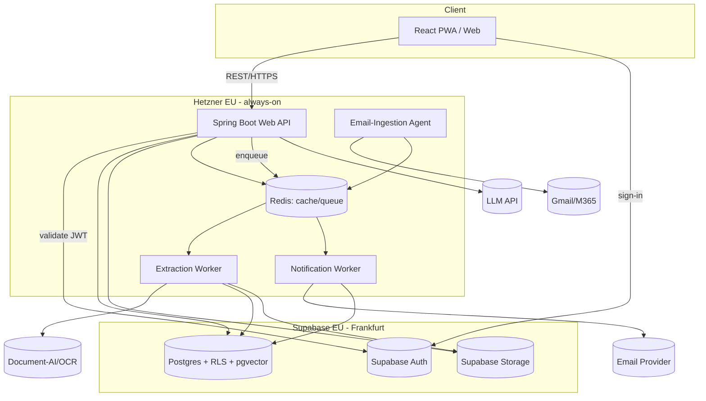
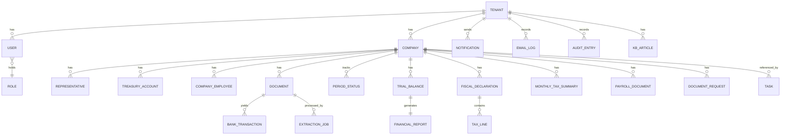
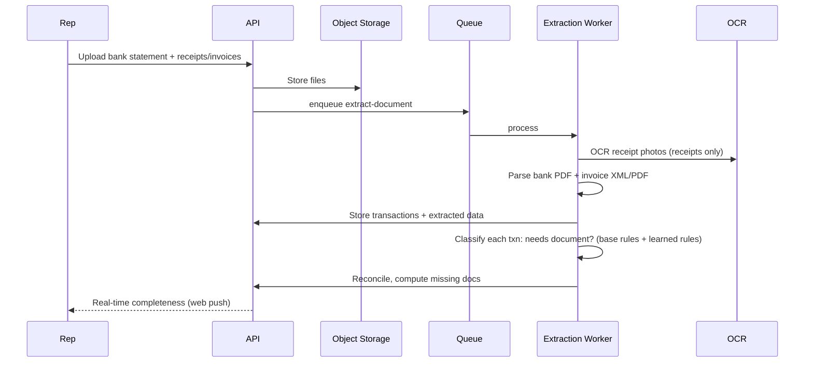
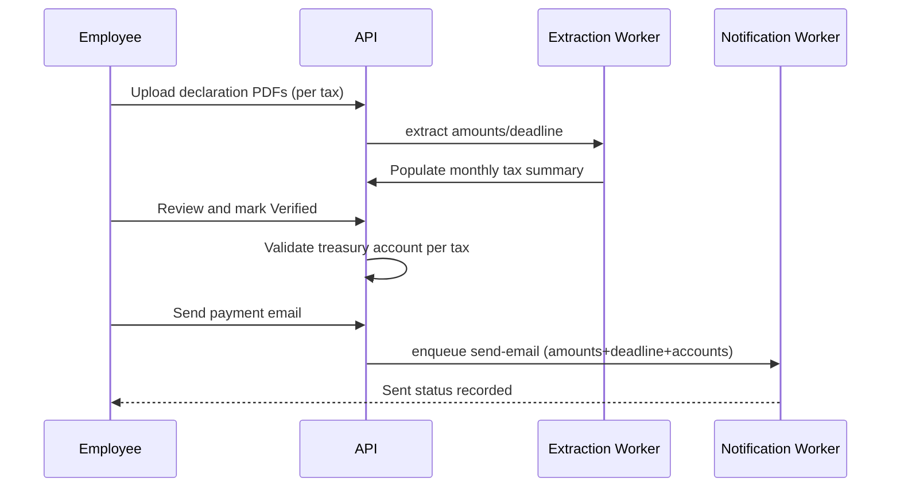
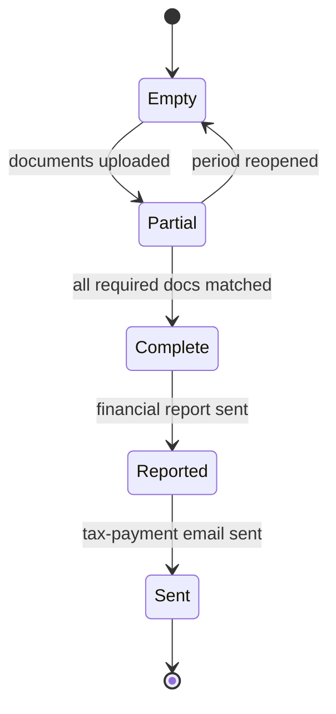
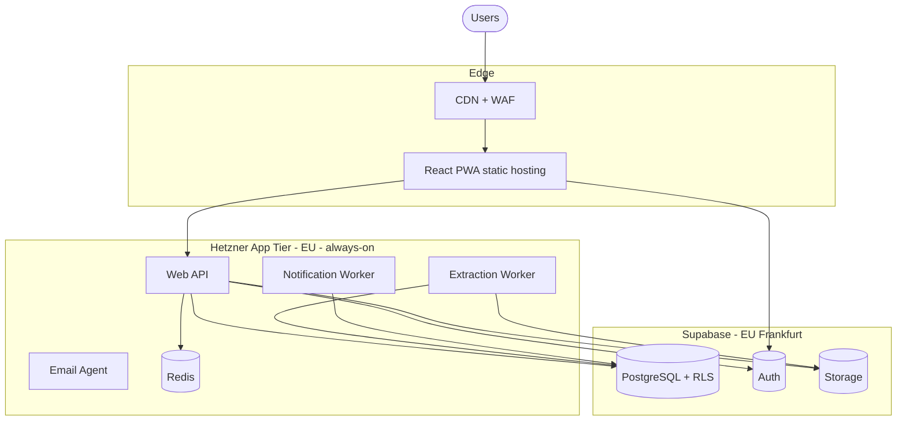

# MyFinance Accounting Portal — Solution Architecture

**Client:** Accounting Firm (multi-tenant SaaS) · **Version:** 1.0 · **Status:** Draft · **Date:** 31 May 2026

---

## 1. Executive Summary

MyFinance is a multi-tenant SaaS portal connecting accounting firms with the client companies whose accounting they manage. It centralizes document exchange, reconciliation, financial reporting, fiscal-declaration handling, payroll distribution, notifications, tasks, and a client-facing assistant.

The architecture is a **modular monolith** (Java / Spring Boot) exposing a REST API to a **React PWA**, with **asynchronous workers** handling the heavy, bursty work — document extraction, reconciliation, and outbound email/notifications. Identity, data, and files are consolidated on **Supabase** (managed **PostgreSQL** with `tenant_id` + row-level security, **Supabase Auth**, **Supabase Storage**, and **pgvector**), with **Redis** for caching and the job queue. Receipt photos are extracted with **Claude vision** (via AWS Bedrock, EU region); bank-statement and invoice PDFs are parsed structurally in-process (Apache PDFBox + tabula-java). The backend and async worker run **always-on on a low-cost EU host (Hetzner)** — deliberately not serverless, because the workers are long-running — the React frontend is served from cheap static hosting (Vercel/Cloudflare), and everything sits in the **EU region** for GDPR data residency.

The design deliberately favors low build and run cost for a one-team, medium-scale MVP, while keeping clean module boundaries (mapped to MOD-01…14) so the system can be decomposed later if scale demands it.

## 2. Goals & Constraints

**Goals**

- Enable client-driven document upload with real-time missing-document detection (the core differentiator).
- Automatically extract amounts owed to the state from fiscal declarations and send templated payment emails.
- Give employees a single monthly control-tower dashboard across all client companies.
- Operate as a secure, auditable, GDPR-compliant multi-tenant SaaS sellable to many firms.
- Keep MVP build and run cost low; ship a PoC that de-risks extraction first.

**Constraints**

- Backend Java / Spring Boot on Hetzner (cheap always-on EU host); Supabase for Auth + Postgres + Storage; frontend React on Vercel/Cloudflare.
- EU data residency; business-hours availability target for MVP. (Supabase is EU-hosted on AWS Frankfurt but US-incorporated — Schrems II exposure accepted for MVP, EU-sovereign fallback noted.)
- Medium scale: ~10–30 tenants, ~1–3k companies, ~1–3k representatives, with month-/quarter-end upload bursts.
- Multi-tenant from day one (shared DB + row-level security); provisioning only (no billing) in MVP.
- Bilingual UI (Romanian + English).
- Manual/minimal data migration (spreadsheet import; no full historical migration).

## 3. Considerations Checklist

| Concern | Applicable | Notes |
|---|---|---|
| Architectural style & patterns | Yes | Modular monolith + async workers |
| Component / module decomposition | Yes | Mapped to MOD-01…14 |
| Bounded contexts (DDD) | Deferred | Module boundaries now; full DDD only if split later |
| API design & versioning | Yes | REST, URI-versioned |
| Data model | Yes | Relational, PostgreSQL |
| Data classification & retention | Yes | PII + statutory accounting-records retention |
| Data migration / coexistence | Deferred | Manual/minimal import in MVP |
| Integration architecture | Yes | Email, Gmail/M365, Google OAuth, Document-AI |
| Event-driven / messaging | Yes (light) | Job queue for extraction/email, not full event sourcing |
| Deployment model & environments | Yes | Dev/Staging/Prod, EU cloud |
| Network topology | Yes | Public edge / private app / data tiers |
| Infrastructure as Code | Yes | Terraform |
| Release strategy | Yes | Rolling + feature flags |
| CI/CD pipeline | Yes | Build/test/scan/deploy |
| Multi-region / DR | No | Single EU region acceptable for MVP; backups + PITR |
| Authentication | Yes | Email+password, Google OAuth, TOTP MFA |
| Authorization | Yes | RBAC + tenant RLS |
| Data protection (encryption, PII) | Yes | TLS, encryption at rest, field-level for sensitive |
| API security | Yes | Rate limiting, validation, CORS |
| Compliance (GDPR) | Yes | EU residency, DSR, retention-aware erasure |
| Audit logging | Yes | Immutable audit log incl. automated actions |
| Secrets management | Yes | Managed secrets store |
| Network security | Yes | WAF, private DB, egress control |
| Session management | Yes | Short-lived tokens + refresh |
| Security headers | Yes | HSTS/CSP/etc. on web |
| Supply-chain security | Deferred | SCA/secret scanning in CI; SBOM later |
| AppSec pipeline | Yes (light) | SAST/SCA/secret scan in CI |
| Threat model (STRIDE) | Yes | Sensitive data + public exposure |
| Privacy by design / residency | Yes | EU residency, data minimization |
| Incident response | Deferred | Basic runbooks for MVP |
| Performance & SLOs | Yes | Interactive UX; async extraction |
| Caching strategy | Yes | Redis + CDN |
| Database performance | Yes | Indexes, tenant-aware queries |
| Async processing & backpressure | Yes | Queue with retries/DLQ |
| Rate limiting / throttling | Yes | Per-tenant/per-user |
| Load/stress/soak testing | Deferred | Targeted load test before launch |
| Scalability strategy | Yes | Stateless app + worker scaling |
| Sharding / partitioning | No | Medium scale; not needed |
| Read/write split | Deferred | Add read replica when reporting load grows |
| Consistency model | Yes | Strong (single primary) |
| Capacity planning | Yes | Sized for month-end bursts |
| Geographic distribution / edge | No | Single EU region |
| Reliability & resilience | Yes | Retries, circuit breakers, graceful degradation |
| RTO/RPO per component | Yes | Defined per data store |
| Retry / circuit breaker | Yes | On external calls (OCR, email, Gmail/M365) |
| Graceful degradation | Yes | Accept-and-queue when extraction down |
| Chaos testing | No | Premature for MVP |
| Health checks | Yes | Liveness/readiness |
| Observability — logging | Yes | Structured + correlation IDs |
| Observability — metrics | Yes | RED/USE + business metrics |
| Distributed tracing | Deferred | Single deployable; add if split |
| Dashboards & alerting | Yes | Error + delivery + extraction dashboards |
| On-call & runbooks | Deferred | Lightweight for MVP |
| Maintainability & code org | Yes | Modular packages, clear boundaries |
| Testing strategy | Yes | Unit/integration/contract/E2E |
| API versioning & deprecation | Yes | URI versioning |
| Architecture fitness functions | No | Premature for MVP |
| Cost / FinOps | Yes | Low-cost EU stack, per-tenant cost awareness |
| Internationalization (i18n) | Yes | Romanian + English |
| Localization workflow | Yes | Message catalogs |
| Time zones & currency | Yes | UTC storage; RON + foreign currency |
| Accessibility (WCAG) | Yes (target) | WCAG 2.2 AA target for client-facing UI |
| Multi-tenancy / isolation | Yes | Pool model: shared DB + RLS |
| AI/ML model lifecycle | Yes | Chatbot (RAG/LLM) + OCR service |
| NFR traceability | Yes | Section 18 |
| ADRs | Yes | Section 19 |
| Technical risks | Yes | Section 20 |
| Phasing (PoC/MVP/Future) | Yes | Section 17 |

## 4. Architectural Style & Patterns

**Primary style:** Modular monolith with separate asynchronous workers. A single Spring Boot deployable hosts all domain modules behind a REST API; a worker process consumes a job queue for extraction, reconciliation, report generation, and outbound messaging.

**Rationale:** One team, medium scale, and tight coupling around a shared monthly accounting cycle make a modular monolith dramatically cheaper to build, test, deploy, and operate than microservices, while clean module boundaries keep future decomposition open. Only the genuinely bursty/slow work is offloaded to async workers.

**Internal architecture:** Layered / hexagonal per module — domain logic isolated behind ports, with adapters for persistence, object storage, OCR, email, and identity providers. This keeps the OCR/Document-AI provider and the email/Gmail integrations swappable.

**Patterns applied:** Repository, ports-and-adapters (anti-corruption layer around external services), background-job queue with idempotent consumers, outbox-style reliable email/notification dispatch, feature flags for tenant capabilities, and an extraction "strategy" interface selecting structured-parse vs. OCR per document type.

## 5. Technology Stack

| Layer | Technology | Justification |
|---|---|---|
| Backend | Java 21, Spring Boot 3 (Web, Security, Data JPA, Validation) | Team preference; mature, productive, strong ecosystem |
| Async workers | Spring + queue consumers (same codebase, separate process) | Reuse domain code; isolate heavy/bursty work |
| Job queue | Redis (or a managed queue) | Simple, cheap; backs extraction/email jobs with retries/DLQ |
| Database | Supabase PostgreSQL (EU/Frankfurt) with Row-Level Security + pgvector | Managed Postgres; RLS hardens tenant isolation; pgvector for chatbot; consolidated with Auth/Storage |
| Authentication | Supabase Auth (email+password, Google OAuth/OIDC, TOTP MFA) | Covers all auth requirements out of the box (TOTP free); Spring validates Supabase JWTs |
| Cache / queue | Redis (on Hetzner) or Postgres pgmq | Caching, rate-limit counters, background-job queue |
| Object storage | Supabase Storage (S3-compatible) | Document and generated-PDF storage, consolidated with DB/Auth |
| Frontend | React + Vite (SPA), installable PWA | Simplest standard path; cheap static hosting; camera + web push |
| PDF parsing | Apache PDFBox (readable-PDF text), tabula-java (bank-statement & balance tables), JAXB/Jackson-XML for **embedded ANAF declaration XML** (e.g. `d212.xml`) and e-Factura. Per-bank parsers behind one BankStatementParser port; per-declaration-type XML mappers behind one extractor port. Avoid iText (AGPL). | Validated on real BRD statement, BT Leasing invoice, Situație profit, and ANAF D212 — all readable PDFs / embedded XML, parsed in-process with no per-page cost. Structured extracts self-cross-check (declaration component taxes sum to total; balance lines sum to stated totals). OCR only for photo receipts. |
| Receipt OCR | Claude vision via AWS Bedrock (EU region) — structured JSON extraction; self-hosted PaddleOCR as EU-sovereign fallback | Only photo receipts need OCR; behind a swappable adapter; benchmark in PoC; amounts always re-verified in reconciliation |
| Email (outbound) | Amazon SES (EU region) via Spring JavaMailSender; Thymeleaf templates; SPF/DKIM/DMARC | Cheapest with solid deliverability; EU residency |
| Email ingestion | Gmail API / Microsoft Graph (OAuth 2.0) | Email-agent pulls document attachments |
| Notifications | In-app via Supabase Realtime; web push via Web Push API + VAPID (nl.martijndwars:web-push); email via SES | Cheap, leverages Supabase; WhatsApp (Future) behind flag |
| AI assistant | Claude (LLM + vision) via managed API + pgvector retrieval over KB + scoped account data | Grounded representative chatbot; same vendor as receipt OCR |
| IaC | Terraform | Reproducible EU infrastructure |
| CI/CD | GitHub Actions (build, test, SAST/SCA/secret scan, deploy) | Standard, low cost |
| Observability | Structured logging + metrics + dashboards/alerting (provider-native or Grafana stack) | Production operability |
| Hosting | Frontend on Vercel/Cloudflare Pages; Java/Spring **backend + worker always-on on Hetzner** (cheap EU); Supabase (managed) for DB/Auth/Storage | Cost-optimized, EU residency; always-on host required for long-running workers |

## 6. System Architecture & Module Mapping

The system is one backend with internal modules, a React PWA, an async worker, and a small set of external services.

| Component | Modules | Responsibility | Interfaces |
|---|---|---|---|
| Web API (Spring Boot) | MOD-01…13 | REST API, auth, business logic, orchestration | HTTPS/REST to frontend; DB; queue; object storage |
| React PWA | MOD-02, 04, 06, 07, 08, 11, 13, 14 | All user UIs; camera capture; web push | REST to Web API |
| Extraction Worker | MOD-04, 05, 06, 07 | OCR/parse documents, reconcile, generate reports | Queue consumer; OCR API; object storage; DB |
| Notification Worker | MOD-09 | Send email + in-app; scheduled rules; delivery tracking | Queue consumer; email provider; DB |
| Email-Ingestion Agent | MOD-04 | Poll Gmail/M365, import attachments, triage | Gmail/Graph API; queue; object storage |
| Identity & Access | MOD-01, 02 | Tenancy, roles, auth, MFA, OAuth, RLS context | DB; Google OIDC |
| Knowledge/Chatbot service | MOD-13 | Retrieval-grounded Q&A, KB management | LLM API; pgvector; DB (scoped) |
| PostgreSQL | all | System of record (tenant-scoped via RLS) | SQL |
| Object Storage | MOD-04…08 | Documents, generated PDFs | S3 API |
| Redis | cross-cutting | Cache, sessions, queue, rate limits | — |

### 6.1 C4 — System Context

### 6.2 C4 — Containers

## 7. Data Model

Core entities (tenant-scoped). Every table carries `tenant_id` and is protected by row-level security.

Key entities: Tenant, User (role, mfa), Company (type, CUI, VAT status, tax regime, responsible employee), Representative (one company), TreasuryAccount (tax type + locality + IBAN), Document (type, period, source, file ref, status), BankTransaction (date, amount, direction, partner name, partner IBAN, description, matchedDocumentId, **requiresDocument**, **decisionSource** = SYSTEM_RULE/LEARNED_RULE/ACCOUNTANT_SET, **category**, overrideReason), TransactionRule (per-company learned rule: (partner IBAN, normalized description) → requiresDocument, created from accountant decisions), ExtractionJob (confidence, review state), PeriodStatus (per company/month), TrialBalance, FinancialReport, FiscalDeclaration + TaxLine, MonthlyTaxSummary (amounts per tax, deadline, verification + email status), PayrollDocument, DocumentRequest (what was asked of a company + status), Notification, EmailLog (what was emailed, to whom, when, delivery status), AuditEntry, Task, KBArticle (with embedding for retrieval).

## 8. Data Architecture — Classification & Retention

| Class | Examples | Controls |
|---|---|---|
| Public | KB articles (published) | Standard access control |
| Internal | Tasks, dashboards, period status | Tenant-scoped RBAC |
| Confidential | Financial reports, tax amounts, bank transactions | RBAC + encryption at rest + audit |
| Sensitive PII | Identifiers (CUI/CNP), payroll/salary, contact data | Field-level encryption, strict scoping, masked in logs |

**Retention:** Legally-required accounting records are retained for the statutory period (to be confirmed with the firm; Romania commonly multi-year). Retention-aware erasure on request: revoke access and anonymize non-required PII immediately, retain mandated records for the window, full purge after. Audit log retained per policy and immutable. Storage: OLTP in PostgreSQL; documents/PDFs in object storage; KB embeddings in pgvector.

## 9. API & Integration Design

REST over HTTPS, JSON, **URI-versioned** (`/api/v1`). OpenAPI is the contract source of truth with a breaking-change CI gate. Synchronous request/response for interactive operations; **asynchronous** (enqueue + status polling/web push) for extraction, report generation, and bulk email. Anti-corruption adapters wrap every external service.

| System | Protocol | Format | Direction | Notes |
|---|---|---|---|---|
| Amazon SES (EU) | API/SMTP | MIME | Outbound | Reports, tax/payroll emails, notifications; SPF/DKIM/DMARC |
| Gmail / Microsoft 365 | OAuth 2.0 API | MIME/JSON | Inbound | Email-ingestion agent |
| Google Identity (via Supabase Auth) | OAuth 2.0 / OIDC | JWT | Inbound | Sign-in for all user types |
| Claude vision (AWS Bedrock, EU) | HTTPS API | Image → JSON | Bidirectional | Receipt OCR only; PaddleOCR self-hosted fallback |
| WhatsApp Business API | HTTPS API | JSON | Outbound | Future (feature-flagged) |
| e-Factura / ANAF SPV | HTTPS API | XML | Inbound | Future |

## 10. Asynchronous Processing

A Redis-backed job queue decouples slow/bursty work. Jobs: `extract-document`, `reconcile-period`, `generate-report`, `send-email`, `run-notification-rule`, `ingest-mailbox`. Consumers are **idempotent** (keyed by document/period/message id), with **exponential backoff + DLQ** for poison messages. Outbound email/notification uses an outbox pattern so a crash never double-sends or loses a message. Backpressure: queue-depth limits + accept-and-queue uploads when extraction is saturated (month-end bursts).

## 11. Key Process Flows

**Document intake → reconciliation**

**Transaction document-requirement classification (MOD-04) — adaptive rules, no LLM.** Each parsed bank transaction carries a `requiresDocument` decision plus a `decisionSource` of **SYSTEM_RULE**, **LEARNED_RULE**, or **ACCOUNTANT_SET**. A deterministic **base rule engine** resolves the unambiguous majority using structured signals: direction (incoming/credit = income → none); counterparty IBAN prefix (`…TREZ…` = Treasury → covered by declaration; the company's own IBANs → internal transfer → none); description keywords (`salariu` → payroll; `leasing`/`rată` → leasing invoice; `comision`/`taxă` → bank fee); otherwise a supplier debit → invoice required. The system is **adaptive**: when an accountant marks a transaction "no document needed" (or the reverse), it stores a **learned rule** for that company keyed on `(partner IBAN, normalized description)`; in later periods any transaction matching that signature is auto-classified the same way (decisionSource = LEARNED_RULE), so the firm is never asked twice. An **accountant override** always wins, is audited, and creates/updates the learned rule. Only `requiresDocument && unmatched` transactions drive the missing-documents list and reminder emails. Validated on a real BRD statement: of 6 transactions only the supplier and leasing debits genuinely required a document. No LLM is used; classification is fully deterministic and explainable. Consistent with the golden rule — no money figure auto-drives an email without the accountant gate.

**Fiscal declaration → state-payment email**

**Per-company monthly status**

## 12. Deployment Architecture

**Model:** Multi-tenant SaaS, single EU region. Cost-optimized split hosting.

| Environment | Purpose | Data |
|---|---|---|
| Dev | Development/integration | Synthetic |
| Staging | Pre-prod validation, UAT | Anonymized/synthetic |
| Production | Live | Real (EU residency) |

**Topology:** Public edge (CDN + WAF) → React frontend on static hosting (Vercel/Cloudflare); **Java/Spring API + async worker always-on on a Hetzner EU host**; **Supabase (EU/Frankfurt)** provides managed PostgreSQL (+ Auth, Storage, pgvector); Redis on Hetzner. Documents served via signed URLs. TLS terminated at the edge; certificates auto-managed. The backend is intentionally not serverless — the extraction/email-ingestion/notification workers are long-running and stateful, which serverless platforms (e.g. Vercel functions) cannot host within their execution limits.

**IaC:** Terraform for Hetzner infra; Supabase managed. **CI/CD:** GitHub Actions — build → unit/integration tests → SAST/SCA/secret scan → deploy; rolling deploys with feature flags. **DR:** Supabase automated backups + point-in-time recovery for PostgreSQL; object storage versioning; documented restore procedure.

## 13. Security Architecture

- **Authentication:** **Supabase Auth** — email+password (verified, lockout), Google OAuth (OIDC), and **TOTP MFA required for employees/admins** (TOTP is free on Supabase); Google Workspace 2FA satisfies it for Google sign-in. The Spring backend acts as a resource server validating Supabase-issued JWTs, with `tenant_id` and role carried as JWT claims.
- **Authorization:** RBAC (Super-Admin, Tenant Admin, Employee, Representative) + **Supabase PostgreSQL row-level security** binding every query to `tenant_id` (the backend sets the tenant context per request); representatives further scoped to their company.
- **Data protection:** TLS 1.2+ in transit; encryption at rest; **field-level encryption** for sensitive PII and payroll; PII masked in logs.
- **API security:** input validation, output encoding, per-tenant/per-user rate limiting, strict CORS, signed URLs for document access.
- **Audit:** immutable audit log of all user and automated actions.
- **Secrets:** managed secret store; no secrets in code/config; rotation supported.
- **Network:** WAF at edge, private DB/Redis, controlled egress to whitelisted external APIs.
- **Sessions:** short-lived access tokens + rotating refresh tokens; revocation on logout/deactivation.
- **Web headers:** HSTS, CSP, X-Frame-Options, Referrer-Policy, Permissions-Policy.
- **AppSec in CI:** SAST, dependency scanning (SCA), secret scanning.

## 14. Threat Model (STRIDE, abridged)

Trust boundaries: Internet ↔ Edge ↔ App ↔ Data; and Tenant ↔ Tenant (logical).

| ID | Category | Asset | Threat | Mitigation | Residual |
|---|---|---|---|---|---|
| T1 | Spoofing | Auth | Credential stuffing | MFA, lockout, OAuth, rate limit | Low |
| T2 | Tampering | Documents | Altered file in transit/store | TLS, signed URLs, integrity checks | Low |
| T3 | Repudiation | Actions | Denying an action | Immutable audit log | Low |
| T4 | Info disclosure | Cross-tenant data | Query leaks another tenant | RLS + tenant context + tests | Low |
| T5 | Info disclosure | PII/payroll | Sensitive data exposure | Field-level encryption, masking, RBAC | Low |
| T6 | DoS | Upload/extraction | Month-end flood | Queue backpressure, rate limits, autoscale | Medium |
| T7 | Elevation | Roles | Privilege escalation | Server-side authz checks, least privilege | Low |
| T8 | Info disclosure | Chatbot | Prompt-injection leaking other data | Strict scoping, grounded retrieval, no cross-tenant context | Medium |

OWASP Top 10 / API Top 10 sweep included in the AppSec checklist.

## 15. Performance, Scalability & Reliability

**Performance/SLOs (targets):** interactive pages p95 < ~1s under normal load; uploads accepted immediately with async extraction and progress feedback; extraction throughput sized to absorb month-/quarter-end bursts. Caching: CDN for static, Redis for hot reads; tenant-aware indexes on `(tenant_id, company_id, period)`.

**Scalability:** Web API and workers are **stateless** and scale horizontally; extraction workers scale on queue depth (the month-end lever). PostgreSQL scales vertically first; a **read replica** is added for reporting when needed (deferred). No sharding at this scale. Strong consistency via a single primary.

**Reliability:** retries with backoff + circuit breakers on OCR/email/Gmail; graceful degradation (accept-and-queue when extraction/OCR is down); liveness/readiness health checks; daily backups + PITR. RTO target hours, RPO ≤ 24h (tightened later if needed).

## 16. Observability, Maintainability, Cost, i18n, Multi-tenancy, AI

**Observability:** structured JSON logs with correlation IDs (no PII), RED/USE metrics plus business metrics (extraction success rate, email delivery, period completeness), dashboards and alerting on failures and queue backlog.

**Maintainability:** modular package structure with enforced boundaries; tests at unit/integration/contract/E2E levels; OpenAPI-generated client; ADRs in-repo.

**Cost / FinOps:** lean EU stack — Hetzner always-on host for backend + worker (low monthly fixed cost), Supabase (~$25/mo Pro for DB + Auth + Storage at our scale), cheap static frontend hosting (Vercel/Cloudflare), and pay-per-use Document-AI used only for receipts (results cached). Resource tagging by env/module; budget alerts; per-tenant cost awareness via tenant tagging on usage metrics. This stack keeps fixed monthly cost low and scales spend mainly with OCR/LLM usage.

**i18n / a11y:** UI in Romanian + English via message catalogs (ICU); UTC storage with locale display; RON + foreign-currency handling with explicit rounding; WCAG 2.2 AA target for client-facing screens.

**Dashboard read-model (MOD-11):** the employee dashboard aggregates, per selected month, a summary tile per section (Statements & invoices, Taxes & payments, Payroll, Reports) counting companies fully-done / partial / not-started, plus a new-companies tile (onboarded this month: in-setup / finished), above the per-company status table. Backed by read-model aggregates over PeriodStatus / MonthlyTaxSummary / EmailLog / company onboarding date — no new authoritative entities.

**Multi-tenancy:** pool model — shared database with `tenant_id` and row-level security; per-tenant feature flags and limits (hard-enforced); tenant suspension pauses jobs; tenant data export/deletion supports GDPR. Database-per-tenant reserved as a future premium tier.

**AI/ML:** (1) **OCR** via managed Document-AI behind a strategy interface, used only for receipts, with confidence thresholds and human review. (2) **Chatbot** — representative-facing, retrieval-grounded over the KB (pgvector) and the user's own scoped data; read-only; disclaimers; low-confidence escalation; audited; feature-flag gated. Broader account-data Q&A flagged for a grounding/guardrails spike.

## 17. Phasing

- **PoC:** prove extraction + reconciliation on real samples (ANAF declaration parse, bank-PDF parse, receipt OCR, missing-doc reconciliation, state-payment email auto-fill). Simplified infra: single small environment, managed Postgres, OCR API; minimal auth/company setup. Goal: de-risk accuracy and cost.
- **MVP:** full MOD-01…12 multi-tenant, bounded chatbot (MOD-13), responsive web + PWA (MOD-14); production-grade security, audit, CI/CD, observability, backups; email + in-app notifications.
- **Future:** WhatsApp channel, e-Factura/ANAF SPV, in-app messaging, native app, per-employee payslip distribution, payroll integration, template customization, per-employee access restriction, database-per-tenant tier, read replicas, distributed tracing.

## 18. Quality-Attribute Traceability (NFR ↔ Design)

| NFR | Architectural response |
|---|---|
| Multi-tenant isolation | Shared DB + RLS + tenant context + cross-tenant tests |
| GDPR / data residency | EU region, field-level encryption, retention-aware erasure, audit |
| Security (sensitive financial data) | MFA, RBAC, encryption, audit, WAF, AppSec CI |
| Month-end concurrency | Async workers + queue backpressure + horizontal scaling |
| Business-hours availability | Managed services, health checks, backups + PITR |
| Bilingual UI | i18n message catalogs (RO/EN) |
| Auditability | Immutable audit log incl. automated actions |
| Low cost | Lean EU split hosting, pay-per-use OCR, modular monolith |
| Extraction accuracy | Structured-parse-first, OCR for receipts only, confidence + human review |

## 19. Key Architectural Decisions (ADRs)

- **ADR-1 Modular monolith over microservices.** Context: one team, medium scale, cost focus. Options: microservices, serverless, modular monolith. Chosen: modular monolith + async workers. Rationale: lowest build/run cost, clean boundaries preserved. Consequence: must enforce module boundaries; vertical scaling first.
- **ADR-2 Shared DB + RLS for multi-tenancy (on Supabase Postgres).** Options: DB-per-tenant, schema-per-tenant, pool+RLS. Chosen: pool + Supabase Postgres row-level security + field-level encryption. Rationale: cost and operability at this scale; RLS is Supabase's native model; isolation hardened in the DB. Consequence: rigorous tenant-context discipline; DB-per-tenant available later as premium.
- **ADR-3 OCR only for receipts.** Context: bank statements are text PDFs, invoices structured. Chosen: structural parsing in-process; managed Document-AI only for receipt photos. Rationale: cuts the hardest/most expensive path to one document type. Consequence: provider behind an interface; benchmarked in PoC.
- **ADR-4 React SPA/PWA + Spring Boot API.** Chosen: simplest standard frontend, cheap static hosting, becomes the PWA. Consequence: split hosting (frontend vs backend) for cost.
- **ADR-5 Java/Spring on Hetzner over Node-on-Vercel.** Context: cost focus; Node-on-Vercel was considered. Options: (a) Node/TS API on Vercel functions, (b) keep Java/Spring on a cheap always-on host. Chosen: keep Java/Spring (team fit) on Hetzner; frontend on Vercel/Cloudflare. Rationale: Node's run-cost saving is marginal, and serverless (Vercel functions) cannot host the long-running extraction/email-ingestion/notification workers within execution limits — an always-on host is required regardless. Consequence: backend is always-on; Vercel used only for the frontend.
- **ADR-7 Claude vision for receipt OCR.** Context: only photo receipts need OCR (PDFs parsed in-process); an LLM is already in the stack for the chatbot. Options: managed Document-AI (Textract/Document AI), self-hosted OCR (PaddleOCR/Tesseract), Claude vision. Chosen: Claude vision via AWS Bedrock (EU region) by default, structured JSON output; self-hosted PaddleOCR as EU-sovereign fallback; benchmark in PoC. Rationale: structured reasoned extraction without per-template setup, same vendor as the chatbot, negligible cost at receipt volume. Consequence: extracted amounts are non-authoritative and must pass reconciliation/confidence checks before posting.
- **ADR-6 Supabase for Auth + Postgres + Storage.** Context: minimize build and run cost. Chosen: consolidate identity, database, object storage, and pgvector on Supabase (EU/Frankfurt); Spring validates Supabase JWTs. Rationale: Supabase Auth covers email/password + Google OAuth + free TOTP MFA out of the box, RLS fits multi-tenancy, and one managed service (~$25/mo Pro at our scale) replaces three components. Consequence: Supabase is US-incorporated (Schrems II exposure) even on EU hosting — accepted for MVP, with a self-hosted/EU-native Postgres fallback documented for strict-sovereignty clients.

## 20. Technical Risks

| Risk | Likelihood | Impact | Mitigation |
|---|---|---|---|
| Receipt OCR accuracy below expectations | Medium | High | PoC benchmark; confidence + human review; structured sources preferred |
| Bank-statement PDF format variety | Medium | Medium | Parser per layout + manual-entry fallback; validate on samples |
| Chatbot broader Q&A leaks/hallucinates | Medium | High | Grounding spike, strict scoping, disclaimers, escalation |
| Month-end load spikes | Medium | Medium | Queue backpressure + worker autoscaling + load test |
| Cross-tenant data leak | Low | High | RLS + tenant-context tests + code review |
| Email deliverability (taxes/reports) | Medium | Medium | Reputable provider, SPF/DKIM/DMARC, bounce handling |
| Cost creep (OCR/LLM usage) | Medium | Medium | Usage caps, caching, receipts-only OCR, model selection by query |

## 21. Open Items

- Extraction validated on real samples (BRD bank statement, BT Leasing invoice, Situație profit, ANAF D212) — all readable PDFs / embedded XML, self-validating. Remaining: build out the per-bank parser and per-declaration XML-mapper library from a few more layouts/types.
- Confirm statutory accounting-records retention period for the erasure policy.
- Confirm month-end concurrency profile for capacity sizing.
- Decide final OCR provider during the PoC (backend host set to Hetzner; Supabase for Auth/DB/Storage).
- Define email→company mapping rules for the ingestion agent.
- Revisit Supabase data-sovereignty (Schrems II) if a client requires strict EU-only legal control; document self-hosted/EU-native Postgres fallback.
